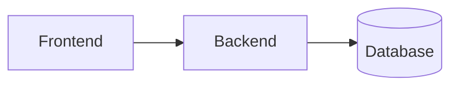

# Lightweight Architecture

Arguments: $ARGUMENTS

A streamlined architecture pass for smaller projects or when you need quick decisions without full ceremony.

## Step 1: Load Context

**If $ARGUMENTS provided**: Read that file or use as topic.
**If no arguments**: Ask "What are we designing architecture for?"

### Check Existing State

```bash
# Existing architecture?
ls docs/architecture/ 2>/dev/null

# Tech decisions already made?
cat CLAUDE.md 2>/dev/null | head -30

# Current stack?
ls -d */ 2>/dev/null
cat package.json 2>/dev/null | grep -A5 dependencies      # Node/JS
cat requirements.txt 2>/dev/null | head -10                # Python
cat pyproject.toml 2>/dev/null | head -20                  # Python modern
```

**If architecture exists**: Ask "Found existing architecture. Update it or start fresh?"

Note pre-made technology choices as constraints - don't re-decide what's decided.

## Step 2: Identify Key Decisions

List only the decisions that **actually need to be made** - skip what's already decided or obvious.

Focus on:
- **Must decide now**: Blocks implementation if unclear
- **Has multiple valid options**: Not obvious which to choose
- **Hard to change later**: One-way doors

Skip:
- Technology already in use
- Standard patterns for your stack
- Decisions that can be deferred

## Step 3: Decide Collaboratively

### Research Before Recommending

For decisions involving libraries/tools, **validate health before presenting**:

**WebSearch** to check:
```
"[library] npm weekly downloads"
"[library] github maintenance status"
"[library] vs [alternative]"
```

**WebFetch** for details:
- npm: `https://www.npmjs.com/package/[name]`
- PyPI: `https://pypi.org/project/[name]`

**Health signals**:
| Signal | ✅ Healthy | ⚠️ Warning | ❌ Avoid |
|--------|-----------|------------|---------|
| Last commit | < 3 months | 3-12 months | > 1 year |
| Downloads | Stable/growing | Declining | Minimal |
| Version | v1+ stable | v0.x active | v0.x stalled |
| Backing | Org/company | Active solo | Abandoned |

**Prefer**: Battle-tested, org-backed, minimal dependencies, active community.

### Present Options

For each decision, use AskUserQuestion:

```
[Decision]: [What needs deciding]

Options:
1. [Option A] - [key tradeoff] [health: ✅ active]
2. [Option B] - [key tradeoff] [health: ⚠️ last release 2022]

Leaning toward: [recommendation + why]
```

Keep it brief - 2-3 options max, one-line tradeoffs. Include library health status.

## Step 4: Document Decisions

Write a concise architecture doc to `docs/architecture/<name>.md`:

```markdown
# [Project] Architecture

**Date**: [date]
**Spec**: [link if exists]

## Tech Stack

| Layer | Choice | Health | Rationale |
|-------|--------|--------|-----------|
| Frontend | React 18 | ✅ | Industry standard, Meta-backed |
| Backend | Express 4 | ✅ | Stable, huge ecosystem |
| Database | SQLite | ✅ | Zero-config, sufficient for scope |

## Decisions

Only non-obvious decisions that were actively made:

### [Decision Title]
**Choice**: [what we decided]
**Why**: [1-2 sentences]
**Rejected**: [alternatives + brief reason]

## Components



[Brief description of each component's responsibility]

## Data Model

[Key entities - keep it minimal]

## Monitor

Libraries with concerns:
- [library]: [issue] - check by [date]

## Open Questions

- [To resolve during implementation]
```

## Step 5: Wrap Up

```bash
mkdir -p docs/architecture
git add docs/architecture/
git commit -m "arch: lightweight architecture for [project]"
```

Done. Move to `/breakdown` or straight to implementation.

## When to Use /arch vs /architecture

| Use `/arch` | Use `/architecture` |
|-------------|---------------------|
| Small-medium scope | Large/complex systems |
| Solo or small team | Multiple stakeholders |
| Tech stack mostly known | Major tech decisions needed |
| Adding to existing system | Greenfield with unknowns |
| Quick iteration | Formal documentation required |
| No issue tracking needed | Want beads integration |

## When to Skip Architecture Entirely

Go straight to `/breakdown` or implementation when:
- Adding a feature to well-established codebase
- All tech choices already made (check CLAUDE.md)
- Scope is a single component or bug fix
- Prototyping/throwaway code

## Anti-Patterns

- Recommending unmaintained or experimental libraries
- Not checking library health before recommending
- Documenting obvious choices (React for a React project)
- Spending more time architecting than implementing
- Choosing "new hotness" over battle-tested solutions
- Skipping this entirely when there ARE real decisions to make
