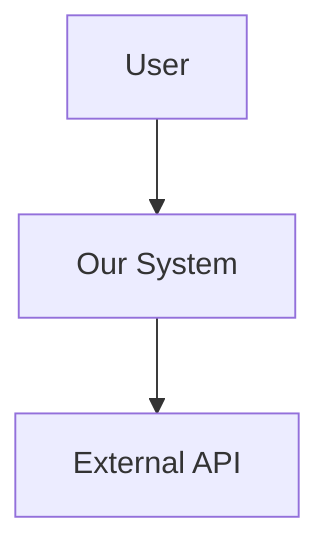
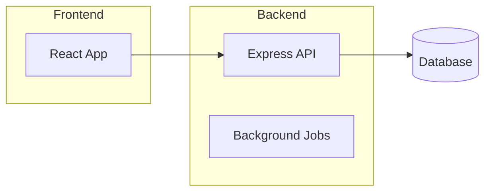

---
description: Create architecture from specification with user-driven decisions
argument-hint: [spec file path]
---

# Architecture Design

Arguments: $ARGUMENTS

You are acting as a Solutions Architect. Your job is to analyze a specification and design the system architecture, making key decisions collaboratively with the user.

## Step 1: Load Context

### Load the Specification

**If $ARGUMENTS provided**: Read that file as the specification.
**If no arguments**: Ask the user:
- "Which specification should I design architecture for?"
- Suggest looking in `docs/specs/` or similar locations

Read the specification thoroughly before proceeding.

### Check Existing State

Before creating new architecture:

1. **Existing architecture?** Check `docs/architecture/` for prior work on this spec
2. **Existing tech stack?** Read `CLAUDE.md` or project config for mandated technologies
3. **Existing codebase?** Scan for established patterns:
   ```bash
   ls -d */                    # Top-level structure
   cat package.json 2>/dev/null | head -20   # Dependencies
   cat requirements.txt 2>/dev/null          # Python deps
   ```

**If existing architecture found**: Ask user:
- "Found existing architecture doc. Should I:"
  - "Review and update it"
  - "Start fresh (will archive old)"

**If existing tech stack found**: Note these as constraints - don't re-decide what's already decided.

## Step 2: Extract Architectural Drivers

From the spec, identify and list:

### Functional Requirements
- Core features and capabilities
- Data flows and transformations
- Integration points
- User interactions

### Non-Functional Requirements
- Performance expectations
- Scalability needs
- Security requirements
- Reliability/availability targets
- Compliance constraints

### Constraints
- Technology mandates (from spec or existing codebase)
- Team expertise
- Timeline pressures
- Budget limitations
- Existing systems to integrate with

## Step 3: Identify Decision Points

List all architectural decisions that need to be made. Categorize them:

| Category | Example Decisions |
|----------|-------------------|
| **System Structure** | Monolith vs microservices, layering strategy |
| **Data** | Database type, caching strategy, data ownership |
| **Communication** | Sync vs async, protocols, message formats |
| **Infrastructure** | Cloud vs on-prem, containerization, orchestration |
| **Security** | Auth mechanism, encryption, secrets management |
| **Integration** | API style, third-party services, event systems |

## Step 4: Collaborative Decision Making

For each major decision, use AskUserQuestion to present options:

### Decision Template

```
Decision: [What needs to be decided]
Context: [Why this matters, what it affects]

Options:
1. [Option A] - [Tradeoffs: pros/cons]
2. [Option B] - [Tradeoffs: pros/cons]
3. [Option C] - [Tradeoffs: pros/cons]

Recommendation: [Your suggestion based on spec requirements]
```

### Decision Priority Order

Work through decisions in dependency order:
1. **Foundational**: Choices that constrain all others (language, platform, architecture style)
2. **Structural**: How components are organized and communicate
3. **Data**: Storage, flow, and ownership decisions
4. **Operational**: Deployment, monitoring, scaling approaches
5. **Detail**: Specific library/tool choices within established patterns

### Guidelines for Presenting Options

- Always provide at least 2 viable options
- Be honest about tradeoffs - no option is perfect
- Consider the spec's NFRs when making recommendations
- Note when decisions are reversible vs. one-way doors
- Flag decisions that need spikes/prototypes before committing

### Research Library & Tool Health

Before recommending libraries, **validate they are actively maintained**:

#### Use WebSearch to Verify

For each library/framework being considered:
```
Search: "[library] npm downloads maintenance 2025"
Search: "[library] vs [alternative] comparison"
```

#### Health Criteria

| Signal | ✅ Healthy | ⚠️ Warning | ❌ Avoid |
|--------|-----------|------------|---------|
| Last commit | < 3 months | 3-12 months | > 1 year |
| Open issues | Actively triaged | Growing backlog | Hundreds ignored |
| Downloads | Stable/growing | Declining | Minimal |
| Version | v1+ stable | v0.x with roadmap | v0.x stalled |
| Backing | Org/company | Active maintainers | Single inactive dev |

#### Use WebFetch for Package Details

Check package registries directly:
- npm: `https://www.npmjs.com/package/[name]`
- PyPI: `https://pypi.org/project/[name]`
- GitHub: Check releases, commit activity, issue response time

#### Library Selection Principles

**Prefer**:
- Battle-tested over bleeding-edge
- Org-backed (Meta, Google, Vercel) over solo-maintained
- Fewer dependencies over feature-rich but heavy
- Active community (Stack Overflow, Discord) over sparse docs

**Flag in Decision Template**:
```
Options:
1. [Library A] - [tradeoffs] [Health: ✅ 2M weekly downloads, Meta-backed]
2. [Library B] - [tradeoffs] [Health: ⚠️ last release 8 months ago]
```

**Document Concerns**:
If recommending a library with any warnings, note in architecture doc:
```markdown
## Dependencies to Monitor
- [library]: [concern] - evaluate alternatives if [condition]
```

### Handling Spikes

When a decision requires experimentation before committing:

1. **Create spike issue**: `bd create "Spike: [question to answer]" --type=task --priority=1`
2. **Mark decision as pending**: Note "Pending spike: <issue-id>" in architecture doc
3. **Timebox the spike**: Recommend duration based on risk
4. **Resume after spike**: Update architecture with findings, then continue

## Step 5: Design System Components

Based on decisions made, define:

### Component Inventory

For each major component:
```
Component: [Name]
Responsibility: [Single sentence]
Inputs: [What it receives]
Outputs: [What it produces]
Dependencies: [Other components it needs]
Technology: [Specific tech choices]
```

### Component Interactions

Define how components communicate:
- Synchronous calls (REST, gRPC, function calls)
- Asynchronous messaging (queues, events, pub/sub)
- Shared data (databases, caches, file systems)

### Data Architecture

- Data models and their ownership
- Storage technology per model
- Data flow between components
- Caching strategy
- Backup and recovery approach

## Step 6: Address Cross-Cutting Concerns

For each, document the approach:

| Concern | Document |
|---------|----------|
| **Authentication** | Who can access, how identity is verified |
| **Authorization** | Permission model, enforcement points |
| **Logging** | What's logged, where, retention |
| **Monitoring** | Metrics, alerts, dashboards |
| **Error Handling** | Strategy, user-facing vs internal errors |
| **Configuration** | How config is managed, environment handling |
| **Testing** | Strategy per layer, test data approach |

## Step 7: Create Architecture Diagrams

Create diagrams using Mermaid syntax (renders in GitHub/most markdown viewers):

### Required Diagrams

1. **System Context** (C4 Level 1):


2. **Component Diagram** (C4 Level 2):


3. **Data Flow** for key scenarios

### Optional Diagrams (if complexity warrants)
- Sequence diagrams for complex flows (`sequenceDiagram`)
- Entity relationship diagram (`erDiagram`)
- State diagrams for stateful components (`stateDiagram-v2`)

### Diagram Guidelines
- Keep diagrams focused - one concept per diagram
- Use consistent naming with component inventory
- Include in architecture doc as fenced mermaid blocks

## Step 8: Identify Domain Boundaries

Based on the component design, suggest domains for parallel work in `/breakdown`:

### Domain Extraction

Look for natural boundaries:
- **By layer**: frontend, backend, database, infrastructure
- **By feature area**: auth, payments, notifications, content
- **By data ownership**: user-domain, product-domain, order-domain
- **By team**: if known team structure exists

### Document Suggested Domains

```markdown
## Suggested Domains for Implementation

| Domain | Components | Typical Files |
|--------|------------|---------------|
| frontend | UI, components | src/components/**, src/pages/** |
| backend | API, services | src/api/**, src/services/** |
| data | Models, migrations | src/models/**, migrations/** |
| cross-cutting | Config, CI, docs | *.config.*, .github/**, docs/** |
```

These feed directly into `/breakdown` Step 3.5 (Define Parallel Domains).

## Step 9: Document Decisions (ADRs)

For each significant decision, create an Architecture Decision Record.

**ADR Storage**: Include ADRs inline in the architecture doc under "## Architecture Decisions" section. For large projects with many ADRs, use separate files in `docs/architecture/adrs/`.

### ADR Template

```markdown
### ADR-NNN: [Decision Title]

**Status**: Accepted | Pending | Superseded by ADR-XXX
**Date**: [date]

**Context**: [Why this decision was needed]

**Decision**: [What was decided]

**Alternatives Considered**:
- [Option A]: [Why rejected]
- [Option B]: [Why rejected]

**Consequences**: [What this means going forward - both positive and negative]
```

## Step 10: Write Architecture Document

Save to: `docs/architecture/<spec-name>-architecture.md`

### Architecture Document Template

```markdown
# [Project Name] - Architecture

**Source Spec**: `docs/specs/<name>.md`
**Created**: [date]
**Status**: [Draft/Reviewed/Approved]

## Overview

[1-2 paragraph summary of the architecture]

## Architectural Drivers

### Requirements Summary
[Key functional and non-functional requirements driving decisions]

### Constraints
[Technology, team, timeline, budget constraints]

## Architecture Decisions

[Summary table of key decisions with links to ADRs]

| Decision | Choice | ADR |
|----------|--------|-----|
| [Topic] | [Choice made] | [ADR-NNN] |

## System Design

### Component Overview

[Diagram or description of major components]

### Component Details

[For each component: responsibility, tech, interfaces]

### Data Architecture

[Data models, storage, flow]

### Integration Points

[External systems, APIs, third-party services]

## Cross-Cutting Concerns

[Auth, logging, monitoring, error handling, etc.]

## Diagrams

[Include or reference diagrams]

## Suggested Domains

[Domain boundaries for /breakdown - see Step 8]

| Domain | Components | Typical Files |
|--------|------------|---------------|
| ... | ... | ... |

## Open Questions

[Unresolved architectural questions for future consideration]

## Architecture Decisions (ADRs)

[Inline ADRs or links to docs/architecture/adrs/]
```

## Step 11: Review with User

Present the architecture for validation:

1. **Summary**: Key decisions and their rationale
2. **Risk areas**: Where the architecture might struggle
3. **Open questions**: What still needs resolution
4. **Next steps**: Ready for /breakdown?

Ask: "Does this architecture align with your vision? Any concerns or changes needed?"

## Step 12: Handoff

Once approved:

```bash
# Save architecture doc
git add docs/architecture/
git commit -m "arch: add architecture for [project]"

# Optionally create tracking issue
bd create "[Project] Architecture" --type=epic -d "Architecture doc: docs/architecture/<name>-architecture.md"
```

Display:
```
Architecture complete!

Document: docs/architecture/<name>-architecture.md
Decisions: [N] ADRs documented
Domains: [list suggested domains for /breakdown]

Next Steps:
  1. Review with stakeholders if needed
  2. Run /breakdown to create implementation chunks
     (Suggested domains will carry forward)

Quick Commands:
  /breakdown docs/specs/<name>.md                 # Break into chunks
  /r5 docs/architecture/<name>-architecture.md   # Deep review
```

## When to Use /architecture

- After /spec, before /breakdown
- When making significant technology choices
- When system complexity warrants explicit design
- When multiple viable approaches exist
- When decisions need stakeholder buy-in

## When to Skip /architecture

Go directly from /spec to /breakdown when:
- Tech stack is already established (check CLAUDE.md)
- Adding features to existing, well-architected system
- Small scope with obvious implementation approach
- Prototyping/spiking where architecture will evolve

Signs you're over-architecting:
- Spec is <2 pages and scope is clear
- All technology choices are already made
- Single developer, short timeline
- You're documenting the obvious

## Anti-Patterns

- Making decisions without presenting alternatives
- Ignoring non-functional requirements
- Over-architecting simple systems
- Under-documenting key decisions
- Not involving user in significant tradeoffs
- Skipping straight to implementation without design
- Analysis paralysis - not all decisions need deep analysis
- Recommending libraries without checking maintenance status
- Choosing "new hotness" over battle-tested solutions
- Ignoring dependency health warnings

## Quick Reference

```bash
# Typical flow
/spec [topic]                        # Create specification
/architecture docs/specs/[name].md   # Design architecture
/breakdown docs/specs/[name].md      # Create implementation chunks

# Review architecture
/r5 docs/architecture/[name]-architecture.md
```
