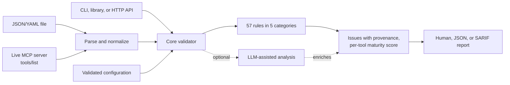
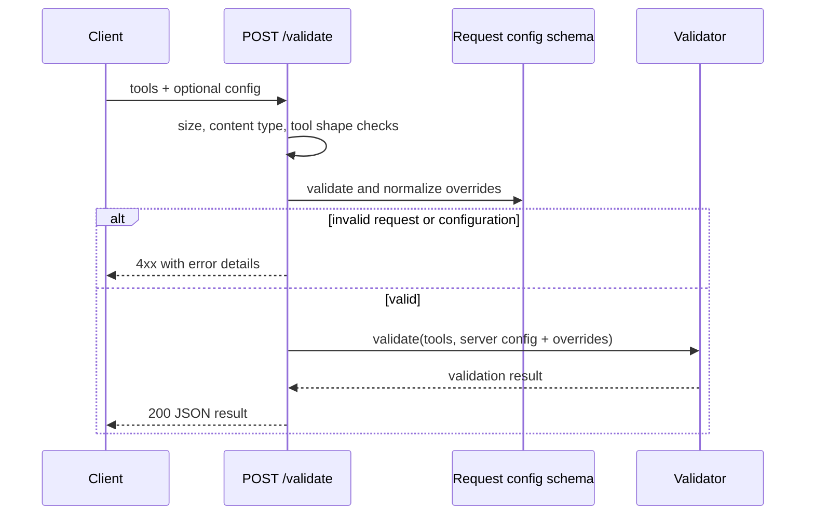

# MCP Tool Description Validator

[](https://github.com/chief-builder/mcp_tool_description_validator/actions/workflows/ci.yml)
[](LICENSE)

A validator for [Model Context Protocol](https://modelcontextprotocol.io) (MCP)
tool definitions. It reads tools from a JSON/YAML file or discovers them from a
live MCP server, checks them against 57 rules for specification compliance,
security, naming, LLM compatibility and agent ergonomics, and reports each
finding with its provenance (specification, governance policy, or heuristic)
plus a 0–100 maturity score. It runs as a CLI, a TypeScript library, or a small
HTTP service, and emits human-readable, JSON, or SARIF 2.1.0 output for CI.

## Why it matters

An MCP tool's name, description and input schema are the only things a model
sees when deciding whether and how to call it. Vague descriptions cause wrong
tool choices, unbounded string and array parameters widen the attack surface,
and schemas that break the specification are rejected by strict clients. This
validator catches those problems before a server ships, and separates hard
specification violations from policy and style advice so that a strict
in-house policy is never reported as MCP noncompliance.

## Contents

- [Quickstart](#quickstart)
- [How it works](#how-it-works)
- [Usage](#usage)
- [Configuration](#configuration)
- [Validation rules](#validation-rules)
- [Maturity scoring](#maturity-scoring)
- [LLM-assisted analysis](#llm-assisted-analysis)
- [Real-world validation evidence](#real-world-validation-evidence)
- [Development](#development)
- [Project status and limitations](#project-status-and-limitations)
- [Documentation](#documentation)
- [License](#license)

## Quickstart

Requires [Node.js](https://nodejs.org) 22.18 or later (`.nvmrc` pins 24, the
current LTS).

The package is **not published to npm**; install from source. (The npm name
`mcp-tool-validator` belongs to an unrelated project, so do not
`npm install` it.)

```bash
git clone https://github.com/chief-builder/mcp_tool_description_validator.git
cd mcp_tool_description_validator
npm ci
npm run build

# Validate the bundled examples
node bin/mcp-validate.js examples/polished-tools.json
node bin/mcp-validate.js examples/needs-work-tools.json --verbose
```

To put `mcp-validate` on your PATH, run `npm link` in the repository, then:

```bash
mcp-validate path/to/tools.json
```

The rest of this README uses `mcp-validate`; substitute
`node bin/mcp-validate.js` if you did not link it.

## How it works



| Module | Responsibility |
|---|---|
| `src/parsers/` | Read files (single tool, array, `{ tools }`, or manifest) and discover tools from live servers |
| `src/core/` | Configuration loading and validation, rule loading, rule execution, scoring |
| `src/rules/` | One file per rule, grouped by category, plus shared bounded schema traversal |
| `src/reporters/` | Pure functions that render a result as human text, JSON, or SARIF |
| `src/service/` | Hono HTTP service (`/health`, `/validate`) |
| `src/llm/` | Optional AI SDK analysis (Anthropic, OpenAI, Ollama) |
| `src/cli.ts` | Commander CLI |

Every input is normalized into a common tool shape before rules run. Static
rules always produce a result; optional LLM analysis adds to it and cannot
discard static findings if a provider is unavailable.

**Live discovery.** The default 2026-07-28 path sends stateless `tools/list`
requests with per-request metadata over Streamable HTTP or stdio, follows
pagination, validates JSON-RPC 2.0 envelopes and response IDs, requires valid
`ttlMs` and `cacheScope` hints on every page, and preserves structured protocol
errors (`HeaderMismatchError`, `UnsupportedProtocolVersionError`). The
2025-11-25 path uses the official SDK's initialization flow. Discovery is
bounded: per-operation timeout (default 30 s), at most 100 pages, 10 MiB per
HTTP response, and no HTTP redirects. The validator only lists tools: it never
calls `tools/call` or `server/discover`.

## Usage

### CLI

```bash
# Validate a JSON or YAML file of tool definitions
mcp-validate tools.json

# Validate a live MCP server (stdio command or HTTP URL)
mcp-validate --server "node ./my-server.js"
mcp-validate --server "http://localhost:3000/mcp"

# Servers that only support initialization-based discovery
mcp-validate --server "node ./legacy-server.js" --discovery-spec-version 2025-11-25

# Discover with the legacy revision, validate against 2026-07-28 rules,
# and report policy findings as warnings
mcp-validate --server "https://example.com/mcp" \
  --discovery-spec-version 2025-11-25 \
  --spec-version 2026-07-28 \
  --profile compliance

# JSON or SARIF for CI; exit 1 when any error-severity issue is found
mcp-validate tools.json --format sarif > results.sarif
mcp-validate tools.json --ci

# Override individual rules
mcp-validate tools.json --rule SEC-001=off --rule LLM-005=error

# LLM-assisted analysis (needs a provider package and API key)
mcp-validate tools.json --llm --llm-provider anthropic

# Start the HTTP validation service
mcp-validate serve --port 8080
```

> **`--server "<command>"` runs that command** to talk to a stdio server. Only
> validate servers you trust. The server receives a minimal environment
> (`HOME`, `LOGNAME`, `PATH`, `SHELL`, `TERM`, `USER`), not your API keys; to
> pass a variable explicitly, use `--server "env NAME=value node server.js"`.

| Option | Description |
|---|---|
| `[file]` | Tool definition file (JSON or YAML): single tool, array, `{ tools: [...] }`, or manifest |
| `-s, --server <url>` | Validate a live MCP server (HTTP URL or stdio command; quoted args supported) |
| `-f, --format <format>` | Output format: `human` (default), `json`, `sarif` |
| `-c, --config <path>` | Explicit config file path (otherwise auto-discovered) |
| `-r, --rule <RULE-ID=setting>` | Override a rule: `on`, `off`, `error`, `warning`, `suggestion` (repeatable; unknown IDs are rejected) |
| `--spec-version <version>` | MCP revision to validate against: `2026-07-28` (default) or `2025-11-25` |
| `--discovery-spec-version <version>` | MCP revision used for live discovery; defaults to `--spec-version` |
| `--profile <profile>` | `governance` (default, strict policy) or `compliance` (non-specification errors become warnings) |
| `--timeout <ms>` | Live discovery timeout per operation (default 30000) |
| `--llm` | Enable LLM-assisted analysis |
| `--llm-provider <provider>` | `anthropic` (default), `openai`, or `ollama` |
| `-v, --verbose` | Show suggestions and LLM detail |
| `-q, --quiet` | Only show errors and the pass/fail status |
| `--ci` | Exit 1 when any error-severity issue is found |
| `--no-color` | Disable colored output |
| `serve [-p port] [-h host] [-c config]` | Start the HTTP validation service |

Exit codes: `0` success, `1` errors found with `--ci` (or invalid arguments),
`2` runtime error (unreadable file, invalid config, discovery failure).

### Library

```typescript
import {
  validate,
  validateFile,
  validateServer,
} from 'mcp-tool-description-validator';

const result = await validateFile('./tools.json');

console.log(`Valid: ${result.valid}`);
console.log(`MCP compliant: ${result.compliant}`);
console.log(
  `Maturity: ${result.summary.maturityScore}/100 (${result.summary.maturityLevel})`
);
for (const issue of result.issues) {
  console.log(`${issue.severity} ${issue.id}: ${issue.message} [${issue.tool}]`);
}

// Inline overrides; discoverConfig: false skips the config-file search
const direct = await validate(tools, {
  config: { rules: { 'SEC-001': false }, specVersion: '2026-07-28' },
  discoverConfig: false,
});
```

Until a package is published, install from a built local clone:
`npm install /path/to/mcp_tool_description_validator`.

### HTTP service

`mcp-validate serve` exposes:

- `GET /health` returns `{ "status": "healthy", "version": "…" }`
- `POST /validate` takes `{ "tools": [...], "config": { ... } }` and returns a
  full validation result

The service has **no authentication**; it binds to `localhost` by default and
is meant for local or trusted-network use. Requests are untrusted:

- The body must be JSON (`415` otherwise), at most 1 MiB (`413`), with at most
  1000 tool objects (`400`).
- `config` may override `rules`, `output`, `specVersion`,
  `discoverySpecVersion` and `profile`. It is validated like a config file;
  unknown keys, unknown rule IDs, invalid severities, and any `llm` section are
  rejected with `400 Invalid request configuration`.
- The server's own configuration is loaded once at startup (`serve -c <path>`,
  or auto-discovered), and the working directory is never searched per
  request.
- No CORS headers are sent, and internal errors return a generic `500`.
- Logs are JSON lines with method, path, status and duration only.



## Configuration

Configuration is discovered from the working directory, in order:
`mcp-validate.config.yaml`, `mcp-validate.config.yml`,
`mcp-validate.config.json`, `.mcp-validaterc` (plus `.yaml`/`.yml`/`.json`
variants), or an `"mcp-validate"` key in `package.json`. Pass `--config <path>`
to use an explicit file. Configs are validated on load: unknown keys, unknown
rule IDs and invalid values fail with a descriptive error.

| Key | Values | Default | Description |
|---|---|---|---|
| `rules.<RULE-ID>` | `true`/`on`, `false`/`off`, `error`, `warning`, `suggestion` | all enabled | Disable a rule or override its severity |
| `output.format` | `human`, `json`, `sarif` | `human` | Report format |
| `output.verbose` | boolean | `false` | Show suggestions and LLM detail |
| `output.color` | boolean | `true` | Colored terminal output |
| `specVersion` | `2026-07-28`, `2025-11-25` | `2026-07-28` | MCP revision to validate against |
| `discoverySpecVersion` | `2026-07-28`, `2025-11-25` | `specVersion` | MCP revision for live discovery |
| `profile` | `governance`, `compliance` | `governance` | `compliance` downgrades non-specification errors to warnings |
| `llm.enabled` | boolean | `false` | Enable LLM-assisted analysis |
| `llm.provider` | `anthropic`, `openai`, `ollama` | `anthropic` | LLM provider |
| `llm.model` | string | provider default | `claude-haiku-4-5`, `gpt-4o-mini`, or `llama3.2` |
| `llm.apiKey` | string | provider env var | Prefer `ANTHROPIC_API_KEY` / `OPENAI_API_KEY` over committing a key |
| `llm.baseUrl` | URL | provider default | Custom endpoint |
| `llm.timeout` | milliseconds | `30000` | Per-request LLM timeout |

```yaml
# mcp-validate.config.yaml
rules:
  BP-001: off
  SEC-001: error
output:
  format: human
specVersion: '2026-07-28'
profile: governance
```

Explicitly passed CLI flags override file values key by key; everything else
comes from the file, then the built-in defaults. See
[mcp-validate.config.yaml](mcp-validate.config.yaml) for an annotated example.

## Validation rules

57 rules across 5 categories:

| Category | Prefix | Count | Focus |
|---|---|---|---|
| Schema | SCH | 11 | MCP Tool shape and JSON Schema validity (2020-12 by default) |
| Naming | NAM | 7 | Name grammar, uniqueness, descriptive and consistent naming |
| Security | SEC | 11 | Input bounds, sensitive-data handling, header exposure |
| LLM compatibility | LLM | 13 | Descriptions and parameters a model can use correctly |
| Best practice | BP | 15 | Annotations, icons, output schemas, pagination, agent ergonomics |

Three rules apply only to MCP 2026-07-28 and are skipped with
`--spec-version 2025-11-25`: `SCH-009` (network `$ref` handling), `SCH-010`
(`x-mcp-header` constraints) and `SEC-011` (sensitive parameters exposed as
headers). See [docs/RULES.md](docs/RULES.md) for every rule with examples.

Each finding is tagged `specification`, `governance`, or `heuristic`. A result
reports `compliant` (no specification errors) separately from `valid` (no
errors under the active profile), so a strict policy is not presented as MCP
noncompliance. Explicit `--rule` severity overrides win over the profile.

## Maturity scoring

Each tool starts at 100 and loses points per issue; the overall score is the
average across tools.

| Severity | Deduction | Typical cause |
|---|---|---|
| `error` | −5 | Specification violation, missing required field, unbounded input |
| `warning` | −2 | Weak description, missing constraint |
| `suggestion` | −1 | Missing annotation, ergonomics recommendation |

| Score | Level | Meaning |
|---|---|---|
| 91–100 | Exemplary | Optimized for advanced multi-tool agents |
| 71–90 | Mature | Reliable for complex workflows |
| 41–70 | Moderate | Usable in simple agents; some guidance |
| 0–40 | Immature | High risk of misuse |

## LLM-assisted analysis

With `--llm` (or `llm.enabled: true`), each tool is also scored by an LLM for
clarity and completeness, with ambiguities, description/schema conflicts and
suggestions attached. Provider packages are optional peer dependencies:

```bash
npm install @ai-sdk/anthropic   # or @ai-sdk/openai, ollama-ai-provider-v2
```

A failed LLM analysis never discards static results; the error is reported in
`metadata.llmAnalysisError`.

## Real-world validation evidence

On 2026-08-05 the validator was run against Google's managed
[Drive MCP server](https://developers.google.com/workspace/drive/api/reference/mcp).
It discovered eight public tool definitions without requesting Drive
authorization or executing a tool. The first run exposed several heuristic
false positives, which led to six validator requirements (separate discovery
and validation revisions, provenance, schema-aware heuristics, and more).
After they were implemented, the server passed the compliance profile; the
score recorded on 2026-08-05 was 87/100 (Mature), but that run's output was not
retained. A re-run on 2026-10-02 with the same command scored **86/100
(Mature)**, compliant, 8/8 tools passing, and its full JSON output is
committed.

See the [Google Drive case study](docs/case-studies/google-drive.md) for the
commands, results, and interpretation.

## Development

```bash
npm ci
npm test               # build, then run the test suite
npm run test:coverage  # build, then tests with coverage thresholds
npm run lint           # ESLint
npm run format:check   # Prettier (npm run format to fix)
npm run typecheck      # src, tests and scripts
npm run check          # all of the above, as CI runs them
```

The suite has unit tests for every rule, the engine, configuration, parsers,
reporters, the LLM analyzer (providers mocked) and the HTTP service, plus CLI
subprocess tests, a real stdio fixture server, and file-based integration
tests. Security-relevant paths (HTTP request limits, request configuration,
discovery limits, environment isolation, terminal sanitization) have positive
and negative tests. CI runs on Node 22 and 24 and also checks links and runs
CodeQL.

Scripts that reach external services are not part of the test suite:

- `npm run analyze:servers` validates the official MCP reference servers
  (downloads them with `npx`) and writes `reports/`.
- `npm run llm:analyze` runs LLM analysis over the captured fixtures and needs
  `ANTHROPIC_API_KEY`.

See [CONTRIBUTING.md](CONTRIBUTING.md) to contribute and
[SECURITY.md](SECURITY.md) to report a vulnerability.

## Project status and limitations

Pre-1.0 (version 0.2.0); the API and rule set may change. See
[CHANGELOG.md](CHANGELOG.md).

- Not published to npm; install from source.
- Supports MCP revisions 2025-11-25 and 2026-07-28 (the latest released
  revision as of 2026-10-02).
- Live discovery only lists tools, and only without authentication. Servers
  whose `tools/list` requires credentials must be validated from an exported
  file. The validator does not implement `server/discover`.
- Heuristic rules (provenance `heuristic`) are advice and can produce false
  positives; use the `compliance` profile or `--rule` overrides to calibrate.
- The HTTP service has no authentication and is intended for local or
  trusted-network use.
- LLM analysis is optional, sequential, uncached, and its scores are not
  deterministic.

## Documentation

- [docs/RULES.md](docs/RULES.md): rule reference with examples
- [docs/BEST_PRACTICES.md](docs/BEST_PRACTICES.md): tool-design guidance and the scoring framework
- [docs/specs/validator.md](docs/specs/validator.md): product and API specification
- [docs/architecture/validator.md](docs/architecture/validator.md): architecture and dependency decisions
- [docs/test/test-plan.md](docs/test/test-plan.md): verification strategy
- [docs/case-studies/google-drive.md](docs/case-studies/google-drive.md): real-server validation
- [Project site](https://chief-builder.github.io/mcp_tool_description_validator/)

## License

[MIT](LICENSE)
