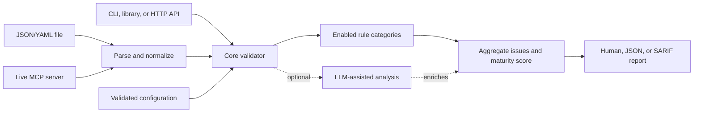
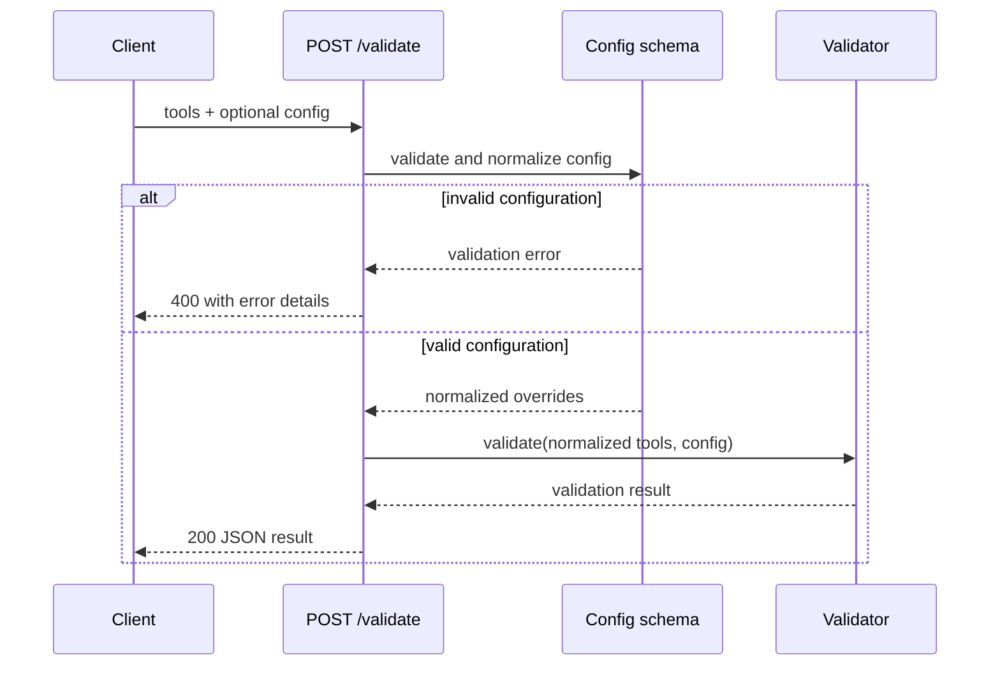
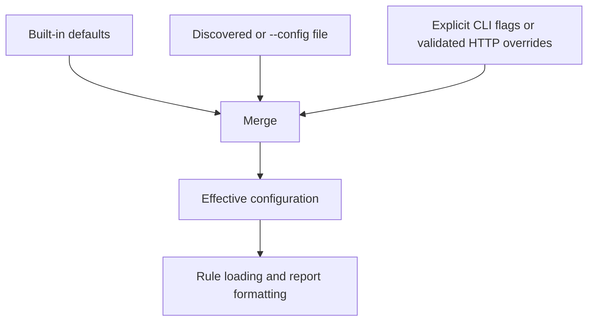

# MCP Tool Description Validator

A governance validator for Model Context Protocol (MCP) tool definitions that ensures quality, security, and LLM-compatibility.

## Overview

The MCP Tool Description Validator analyzes MCP tool definitions and provides actionable feedback to improve:

- **LLM Compatibility**: Ensure tools are easy for language models to understand and use correctly
- **Security**: Identify potential vulnerabilities in input handling and parameter design
- **Spec Compliance**: Validate against the MCP specification, including the draft revision (tool-name grammar, JSON Schema 2020-12, `x-mcp-header`, icons)
- **Agent Ergonomics**: Apply evolved tool-design guidance (pagination, response-format controls, namespacing, overlap detection)

## Features

- **56 validation rules** across 5 categories (3 rules are draft-spec-only and activate with `--spec-version draft`)
- **Maturity scoring** (0-100, per-tool averaged) with level classification
- **CLI** for local validation and CI pipelines
- **HTTP service** (`mcp-validate serve`) for validation as an API
- **Live server validation** over STDIO or Streamable HTTP transports
- **Optional LLM-assisted analysis** (`--llm`) via Anthropic, OpenAI, or Ollama
- **Multiple output formats**: human, JSON, SARIF 2.1.0
- **Programmatic API** for build-pipeline integration

## How Validation Flows



Every input is normalized into a common tool shape before rules run. Static
rules always produce a result; optional LLM analysis enriches it but cannot
discard static findings if a provider is unavailable.

## Installation

```bash
npm install mcp-tool-validator
```

## Quick Start

### CLI

```bash
# Validate a JSON or YAML file of tool definitions
mcp-validate tools.json

# Validate a live MCP server (STDIO command or HTTP URL)
mcp-validate --server "node ./my-server.js"
mcp-validate --server "http://localhost:3000/mcp"

# Validate against the draft MCP spec (enables SCH-009, SCH-010, SEC-011)
mcp-validate tools.json --spec-version draft

# Output JSON or SARIF for CI/CD integration
mcp-validate tools.json --format json
mcp-validate tools.json --format sarif

# CI mode: exit 1 when any error-severity issue is found
mcp-validate tools.json --ci

# Override individual rules
mcp-validate tools.json --rule SEC-001=off --rule LLM-005=error

# LLM-assisted analysis (requires an installed provider package and API key)
mcp-validate tools.json --llm --llm-provider anthropic

# Start the HTTP validation service
mcp-validate serve --port 8080
```

### CLI options

| Option | Description |
|--------|-------------|
| `[file]` | Tool definition file (JSON or YAML): single tool, array, `{ tools: [...] }`, or manifest |
| `-s, --server <url>` | Validate a live MCP server (HTTP URL or STDIO command; quoted args supported) |
| `-f, --format <format>` | Output format: `human` (default), `json`, `sarif` |
| `-c, --config <path>` | Explicit config file path (otherwise auto-discovered) |
| `-r, --rule <RULE-ID=setting>` | Override a rule: `on`, `off`, `error`, `warning`, `suggestion` (repeatable) |
| `--spec-version <version>` | MCP spec revision to validate against: `2025-11-25` (default) or `draft` |
| `--llm` | Enable LLM-assisted analysis |
| `--llm-provider <provider>` | `anthropic` (default), `openai`, or `ollama` |
| `-v, --verbose` | Show suggestions and LLM detail |
| `-q, --quiet` | Only show errors |
| `--ci` | Exit 1 when any error-severity issue is found |
| `--no-color` | Disable colored output |
| `serve [-p port] [-h host]` | Start the HTTP validation service |

### Programmatic usage

```typescript
import { validate, validateFile, validateServer } from 'mcp-tool-validator';

const result = await validateFile('./tools.json');

console.log(`Valid: ${result.valid}`);
console.log(
  `Maturity: ${result.summary.maturityScore}/100 (${result.summary.maturityLevel})`
);
for (const issue of result.issues) {
  console.log(`${issue.severity} ${issue.id}: ${issue.message} [${issue.tool}]`);
}

// Direct validation with inline overrides
const direct = await validate(tools, {
  config: {
    rules: { 'SEC-001': false },
    specVersion: 'draft',
  },
});
```

### HTTP service

`mcp-validate serve` exposes:

- `GET /health` — service health and version
- `POST /validate` — body `{ "tools": [...], "config": { ... } }`, returns a full validation result

Request configuration is validated exactly like file-based configuration.
`on`/`off` rule aliases are normalized to booleans; unsupported keys and
invalid severity values return `400 Invalid request configuration`.



## Validation Rules

56 rules across 5 categories:

| Category | Prefix | Count | Description |
|----------|--------|-------|-------------|
| Schema Validation | SCH | 10 | MCP protocol compliance and JSON Schema validity (2020-12 by default) |
| Naming Conventions | NAM | 7 | Spec name grammar, uniqueness, descriptive and consistent naming |
| Security Constraints | SEC | 11 | Input bounds, sensitive-data handling, header-exposure checks |
| LLM Compatibility | LLM | 13 | Optimizing tool definitions for LLM understanding |
| Best Practices | BP | 15 | Annotations, icons, output schemas, pagination, agent ergonomics |

Three rules only apply when validating against the draft spec (`--spec-version draft`):
`SCH-009` (network `$ref` ban), `SCH-010` (`x-mcp-header` constraints), and `SEC-011` (sensitive parameters exposed as headers).

See [docs/RULES.md](docs/RULES.md) for the complete rule reference with examples.

## Maturity Scoring

The validator calculates a **per-tool averaged** maturity score (0-100). Each tool starts at 100 points, deductions apply per issue, and the server score is the average across all tools.

| Score | Level | Description |
|-------|-------|-------------|
| **91-100** | Exemplary | Optimized for advanced multi-tool agents |
| **71-90** | Mature | Reliable for complex workflows |
| **41-70** | Moderate | Usable in simple agents; some guidance |
| **0-40** | Immature | High risk of misuse; basic functionality only |

### Severity impact

| Severity | Deduction | Examples |
|----------|-----------|----------|
| `error` | -5 points | Spec violations, missing required fields, security vulnerabilities |
| `warning` | -2 points | Suboptimal descriptions, missing constraints |
| `suggestion` | -1 point | Missing annotations, agent-ergonomics recommendations |

## Configuration

Configuration is discovered automatically from (in order): `mcp-validate.config.yaml`, `mcp-validate.config.yml`, `mcp-validate.config.json`, `.mcp-validaterc` (and `.yaml`/`.yml`/`.json` variants), or an `"mcp-validate"` key in `package.json`. Pass `--config <path>` to use an explicit file. CLI flags override file settings per-key; file settings survive for anything not passed on the command line.

```yaml
# mcp-validate.config.yaml
rules:
  BP-001: off            # disable a rule ("off"/"on" or false/true)
  SEC-001: error         # override a rule's severity
output:
  format: human          # human | json | sarif
  verbose: false
  color: true
specVersion: 2025-11-25  # or "draft"
llm:                     # optional LLM-assisted analysis
  enabled: false
  provider: anthropic    # anthropic | openai | ollama
  model: claude-haiku-4-5
  timeout: 30000
  # apiKey: ...          # or ANTHROPIC_API_KEY / OPENAI_API_KEY env vars
```

Configs are validated on load — unknown keys and invalid rule settings fail with a descriptive error instead of being silently ignored.

### Configuration precedence



Only explicitly supplied CLI flags replace file values. HTTP overrides are
validated and normalized before the same merge, so API callers receive the
same rule semantics as CLI and configuration-file users.

## LLM-Assisted Analysis

With `--llm` (or `llm.enabled: true`), each tool is additionally scored by an LLM for clarity and completeness, with ambiguities, description/schema conflicts, and improvement suggestions attached per tool. Provider packages are optional peer dependencies:

```bash
npm install @ai-sdk/anthropic   # or @ai-sdk/openai, ollama-ai-provider-v2
```

A failed LLM analysis never discards static validation results; the error is reported in `metadata.llmAnalysisError`.

## Development

```bash
npm install
npm test              # build + run test suite once
npm run test:watch    # watch mode
npm run typecheck     # typecheck src, tests, and scripts
npm run build         # build dist/
npm run analyze:servers  # validate the official-server fixtures
npm run llm:analyze      # LLM analysis over fixtures (needs ANTHROPIC_API_KEY)
```

## Documentation

- [docs/RULES.md](docs/RULES.md) - Complete rule reference with examples
- [docs/BEST_PRACTICES.md](docs/BEST_PRACTICES.md) - Best practices and maturity scoring framework

## License

MIT
