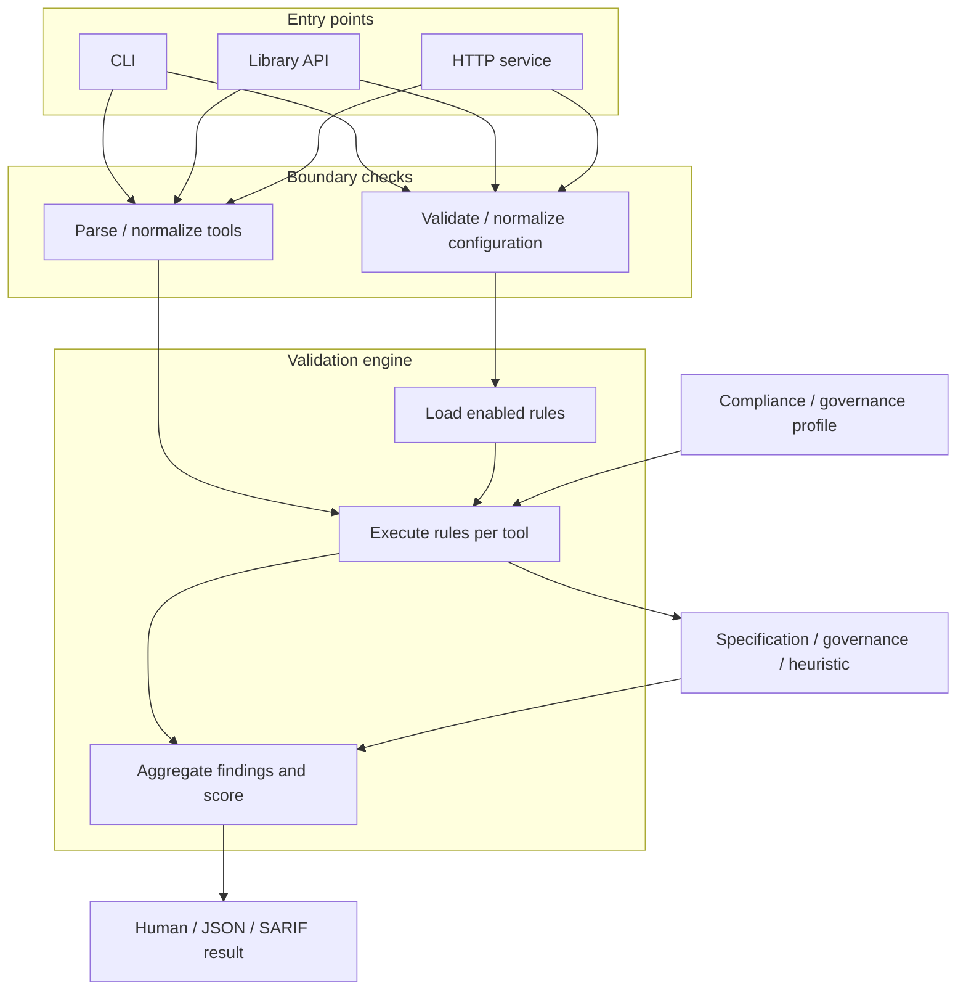

# MCP Tool Validator Architecture

**Updated**: 2026-10-02
**Spec**: [docs/specs/validator.md](../specs/validator.md)

## Tech Stack

| Layer | Choice | Health | Rationale |
|-------|--------|--------|-----------|
| Runtime | Node.js >= 22.18 (`.nvmrc`: 24) | Active | LTS, ESM native |
| Language | TypeScript 6.0 | Active | Type safety, MCP SDK compatibility |
| JSON Schema | Ajv 8.x | Active | JSON Schema 2020-12 validation |
| CLI | Commander 15.x | Active | Small, typed command surface |
| HTTP | Hono 4.x | Active | Lightweight validation service |
| Config | Cosmiconfig 10.x + Zod 4.x | Active | Standard config loading (YAML/JSON, rc files, `package.json`), validated with Zod |
| Testing | Vitest 5.x | Active | Fast TypeScript unit and integration tests |
| Build | tsup 8.x | Active | Zero-config, esbuild-based, fast |
| MCP Client | Native 2026 transport + @modelcontextprotocol/sdk 1.31+ | Active | Current stateless protocol plus legacy compatibility |
| LLM | Vercel AI SDK 6.x | Active | Unified API for OpenAI/Anthropic/Ollama |

## Decisions

### 1. Hono over Fastify for HTTP Service

**Choice**: Hono
**Why**: Lighter footprint for a simple stateless validation API. We only need 2 endpoints (`POST /validate`, `GET /health`). Hono's minimal overhead suits this better than Fastify's full feature set.
**Rejected**: Fastify (overkill for 2 endpoints), Express (slower, dated)
**Request hardening**: The service has no authentication and treats request
bodies as untrusted. `POST /validate` requires `Content-Type: application/json`
(415), limits bodies to 1 MiB (413), and rejects malformed JSON, more than 1000
tools, non-object tool elements, and invalid or `llm`-bearing request config
(400). Internal failures return a generic 500 without details; no CORS headers
are sent. Server config (`serve -c`) is loaded and validated once at startup,
and each request runs `validate(…, { discoverConfig: false })`, so the working
directory is never searched per request. Requests are logged as JSON lines
(method, path, status, duration) without bodies or headers.

### 2. Registry-Based, Config-Driven Rule Selection

**Choice**: Rules are statically registered, then filtered by configuration and
target specification revision before execution.
**Why**: The registry keeps rule discovery deterministic while still supporting
enable/disable settings, severity overrides, and revision-gated rules.

### 3. Vercel AI SDK for LLM Abstraction

**Choice**: Vercel AI SDK (`ai` package)
**Why**: Single unified API for OpenAI, Anthropic, and Ollama. Active maintenance, streaming support, good TypeScript types. Avoids writing our own abstraction layer.
**Rejected**: Direct SDK imports (more code to maintain), LangChain (too heavy for our needs)

### 4. Version-aware MCP client

**Choice**: Native stateless HTTP/stdio requests for 2026-07-28, with @modelcontextprotocol/sdk v1.31+ retained for explicit 2025-11-25 compatibility
**Why**: The stable SDK client still initializes using the legacy protocol flow. The 2026-07-28 revision removes initialization and requires protocol metadata on every request, so the validator uses a small version-pinned transport path for modern live-server discovery. That path calls only `tools/list`; it does not call `server/discover`. It validates JSON-RPC envelopes and IDs, completed-result cache hints on every page, one cache scope across pagination, and structured protocol errors before mapping tool definitions.

### 5. Single Package Distribution

**Choice**: A single package (`mcp-tool-description-validator`) with CLI binary and library exports
**Why**: Simpler versioning, easier installation. The package is not published to npm; install from source (`npm ci && npm run build`), then run `node bin/mcp-validate.js` or `npm link` to put `mcp-validate` on `PATH`. Library via `import { validate } from 'mcp-tool-description-validator'`.
**Rejected**: Monorepo with separate packages (unnecessary complexity for this scope)

### 6. Separate discovery from validation policy

**Choice**: `discoverySpecVersion` controls live-server interoperability while
`specVersion` controls rule loading. `profile` independently controls effective
policy severity.
**Why**: A server can expose valid definitions through an older protocol
revision. Coupling transport negotiation to rule targeting prevented 2026-07-28
validation of Google's Drive MCP endpoint.

### 7. Provenance-aware results

**Choice**: Every runtime finding is labeled `specification`, `governance`, or
`heuristic`; reports expose both `compliant` and `valid`.
**Why**: Strict defensive policy and name/text heuristics must not be presented
as MCP specification failures.

## Components

### Runtime flow



The boundary-check layer is deliberately shared: configuration files and HTTP
request overrides use the same schema and alias normalization. This keeps rule
execution limited to `true`, `false`, or a supported severity override.

```
┌─────────────────────────────────────────────────────────────────┐
│                        Entry Points                              │
├─────────────────┬─────────────────┬─────────────────────────────┤
│   CLI           │   Library       │    HTTP Service             │
│   commander     │   validate()    │    Hono                     │
└────────┬────────┴────────┬────────┴─────────────┬───────────────┘
         │                 │                      │
         └─────────────────┼──────────────────────┘
                           ▼
┌─────────────────────────────────────────────────────────────────┐
│                      Core Validator                              │
│  ┌─────────────────────────────────────────────────────────┐    │
│  │                    validate()                            │    │
│  │  - Load config (cosmiconfig)                            │    │
│  │  - Run enabled rules                                    │    │
│  │  - Aggregate results                                    │    │
│  │  (validateFile / validateServer parse input first)      │    │
│  └─────────────────────────────────────────────────────────┘    │
└─────────────────────────────────────────────────────────────────┘
         │                 │                      │
         ▼                 ▼                      ▼
┌─────────────┐   ┌─────────────┐        ┌─────────────┐
│   Parsers   │   │    Rules    │        │  Reporters  │
├─────────────┤   ├─────────────┤        ├─────────────┤
│ file.ts     │   │ schema/*    │        │ human.ts    │
│ mcp-client  │   │ naming/*    │        │ json.ts     │
│             │   │ security/*  │        │ sarif.ts    │
│             │   │ llm/*       │        │             │
│             │   │ best-prac/* │        │             │
└─────────────┘   └─────────────┘        └─────────────┘
                         │
                         ▼
              ┌─────────────────────┐
              │   LLM Analyzer      │
              │   (Vercel AI SDK)   │
              │   - Optional        │
              │   - Provider-agnostic│
              └─────────────────────┘
```

## Data Flow

```
Input                    Processing                    Output
─────                    ──────────                    ──────

JSON/YAML file  ──┐
                  ├──▶  Parse  ──▶  Normalize  ──▶  Validate  ──▶  Report
MCP Server URL  ──┘              (ToolDefinition[])    │              │
                                                       │              │
                                                       ▼              ▼
                                              Config-driven      Format-specific
                                              rule execution     output (human/
                                              + optional LLM     json/sarif)
```

## Rule Architecture

### Rule Definition

Each rule is a self-contained module:

```typescript
// src/rules/security/sec-001.ts
import type { Rule } from '../types.js';
import type { ValidationIssue } from '../../types/index.js';

const rule: Rule = {
  id: 'SEC-001',
  category: 'security',
  defaultSeverity: 'error',
  description: 'String parameters must have maxLength constraint',

  check(tool, _ctx) {
    const issues: ValidationIssue[] = [];
    // ... validation logic
    return issues;
  },
};

export default rule;
```

### Config-Driven Loading

Rules are loaded based on configuration:

```typescript
// src/core/rule-loader.ts
export async function loadRules(
  config: RuleConfig,
  specVersion: string = DEFAULT_MCP_SPEC_VERSION
): Promise<Rule[]> {
  const rules: Rule[] = [];
  for (const [ruleId, rule] of Object.entries(RULES)) {
    if (config[ruleId] === false) continue;
    if (rule.specVersions && !rule.specVersions.includes(specVersion)) continue;
    rules.push(rule);
  }
  return rules;
}
```

## File Structure

```
mcp_tool_description_validator/
├── src/
│   ├── index.ts                 # Library exports
│   ├── cli.ts                   # CLI entry (commander)
│   ├── core/
│   │   ├── validator.ts         # Main orchestrator
│   │   ├── rule-engine.ts       # Rule execution and aggregation
│   │   ├── rule-loader.ts       # Config/version rule selection
│   │   └── config.ts            # Cosmiconfig loading + Zod validation
│   ├── parsers/
│   │   ├── file.ts              # JSON/YAML parsing
│   │   └── mcp-client.ts        # Native 2026 + SDK-backed legacy discovery
│   ├── rules/
│   │   ├── types.ts             # Rule interface
│   │   ├── schema/
│   │   │   ├── sch-001.ts
│   │   │   └── ...
│   │   ├── naming/
│   │   ├── security/
│   │   ├── llm-compatibility/
│   │   └── best-practice/
│   ├── reporters/
│   │   ├── human.ts
│   │   ├── json.ts
│   │   └── sarif.ts
│   ├── llm/
│   │   └── analyzer.ts          # Vercel AI SDK integration
│   ├── service/
│   │   └── server.ts            # Hono HTTP server
│   └── types/
│       └── index.ts
├── bin/
│   └── mcp-validate.js          # CLI binary shim
├── tests/
│   ├── unit/
│   │   └── rules/               # One test file per rule
│   ├── integration/
│   └── fixtures/
├── package.json
├── tsconfig.json
├── tsup.config.ts
└── vitest.config.ts
```

## Package Exports

```json
{
  "name": "mcp-tool-description-validator",
  "version": "0.2.0",
  "type": "module",
  "exports": {
    ".": {
      "types": "./dist/index.d.ts",
      "import": "./dist/index.js"
    }
  },
  "bin": {
    "mcp-validate": "./bin/mcp-validate.js"
  },
  "engines": {
    "node": ">=22.18.0"
  }
}
```

## Dependencies

### Production

```json
{
  "@hono/node-server": "^2.1.3",
  "@modelcontextprotocol/sdk": "^1.31.0",
  "ai": "^6.0.300",
  "ajv": "^8.20.0",
  "ajv-formats": "^3.0.1",
  "chalk": "^6.0.1",
  "commander": "^15.0.0",
  "cosmiconfig": "^10.0.1",
  "hono": "^4.13.12",
  "yaml": "^2.9.1",
  "zod": "^4.6.5"
}
```

### Development

```json
{
  "typescript": "~6.0.3",
  "tsup": "^8.5.1",
  "vitest": "^5.0.3",
  "@vitest/coverage-v8": "^5.0.3",
  "@types/node": "^22.20.5",
  "eslint": "^10.11.0",
  "prettier": "^3.9.9"
}
```

### Optional Peer Dependencies

LLM provider SDKs (only needed if using LLM analysis):

```json
{
  "peerDependencies": {
    "@ai-sdk/openai": "^3.0.0",
    "@ai-sdk/anthropic": "^3.0.0",
    "ollama-ai-provider-v2": "^3.0.0"
  },
  "peerDependenciesMeta": {
    "@ai-sdk/openai": { "optional": true },
    "@ai-sdk/anthropic": { "optional": true },
    "ollama-ai-provider-v2": { "optional": true }
  }
}
```

## Monitor

| Library | Concern | Check By |
|---------|---------|----------|
| @modelcontextprotocol/sdk | Modern-protocol and future major-version changes | As released |
| Live interoperability | Run version-split discovery checks against managed and reference servers | Before protocol-target changes |
| Heuristic precision | Re-run real-server case studies and regression fixtures | With rule changes |
| Vercel AI SDK | Breaking changes in v7 | As released |

## Current Boundaries and Follow-up

1. **Schema version pinning**: Keep validation behavior pinned to the current MCP 2026-07-28 schema and prose requirements
2. **Rule documentation**: Consolidated in `docs/RULES.md`. Issue output does not link to it; where a rule sets `documentation`, the URL points to the MCP specification (modelcontextprotocol.io) or JSON Schema reference (json-schema.org)
3. **LLM cost management**: Content-hash-based caching remains optional future work

## References

- [Ajv JSON Schema Validator](https://ajv.js.org/)
- [Commander.js](https://github.com/tj/commander.js)
- [Hono](https://hono.dev/)
- [Cosmiconfig](https://github.com/cosmiconfig/cosmiconfig)
- [Vitest](https://vitest.dev/)
- [tsup](https://github.com/egoist/tsup)
- [MCP TypeScript SDK](https://github.com/modelcontextprotocol/typescript-sdk)
- [Vercel AI SDK](https://sdk.vercel.ai/)
